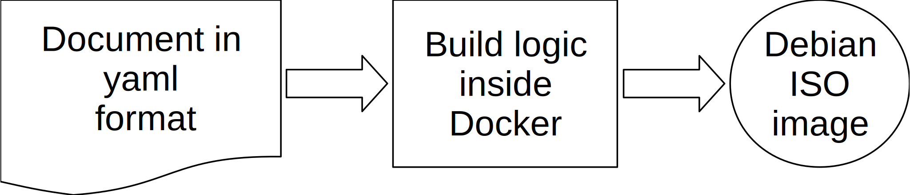

## Presentation

Building an automatic installer for Debian is complex, even if the syntax of the preseed file is rich and offer many
features.  For instance, using advanced features like full disk encryption or logical volumes manager is difficult and
error prone.

This project allows you to use these advanced features very easily, with a simple definition file in YAML format.

There are three flavours you can use, defined in system-example.yml:

| Preseed name | Description                                                        |
|--------------|--------------------------------------------------------------------|
| lvm          | Simple logical volume on one disk, no encryption.                  |
| raid         | Create an ISO image with software RAID and LVM (RAID1, two disks). |
| luks         | Create and ISO image with fully encrypted disk (one disk only).    |

The syntax of the YAML file is simple and self explanatory, and also offers the following features:

- AppArmor activated on boot.
- Root password set.
- Your SSH public key is installed for root.

This script can be used both for development with a virtual machine or for production to install the operating system
base.

## Principle

All the logic to build the ISO image is embedded inside a Docker container, allowing you to build it from Linux, Windows
or MacOS, without problems.

Under the hood, the following packages are used:

- simple-cdd
- reprepro
- Ansible

## Building your ISO image

### 1. Define the system

Copy system-example.yml to system.yml, and modify the values accordingly, for instance:

```yaml

# System configuration for a fully encrypted hard drive
system:
  hostname: mail
  passphrase: I will not give you my password
  preseed: luks
  version: 9.9
  arch: amd64
  boot_timeout: 5   # In seconds

# Network configuration
network:
  domain: deusexmachina.uk
  iface: auto            # or use eth0, ens3, etc...

# Country and locales definition
country:
  code: uk
  timezone: Europe/London

locale:
  id: en_GB
  language: en
  country: UK
  charset: UTF-8
  keymap: gb

# Repository specific values
repo:
  release: stretch
  main: ftp.uk.debian.org
  security: security.debian.org
  sections: main contrib non-free

# Clock parameters
clock:
  utc: true
  ntp: true

# Accounts informations
# You can choose a strong password here,
root:
  password: gQHb8wr683CHskf2

# Debug: As it states
debug: true

```

See system-example.yml for full reference. The file you have copied will be excluded from the repository.

### 2. Setup SSH authentication

Copy your public key into the folder `config/authorized_key`. This file will be copied into the
`/root/.ssh/authorized_keys` by the automatic installer for you to connect using public key authentication.

### 3. Build the ISO image

Then, run this command to build the ISO image:

```sh

./build.sh

```

This will create the ISO images in `/tmp/build-${hostname}/${hostname}-install.iso` folder, for instance
`/tmp/homebox/homebox-install.iso`

The whole installation should be automatic, with LVM and software RAID.  For LVM, there is a volume called "reserved"
you can remove. This will let you resize the other volumes according to your needs.

## Support

Use github issues if you have any troubles.

## Notes

This project has been extracted from [Homebox](https://github.com/progmaticltd/homebox), a self-hosted email solution.
